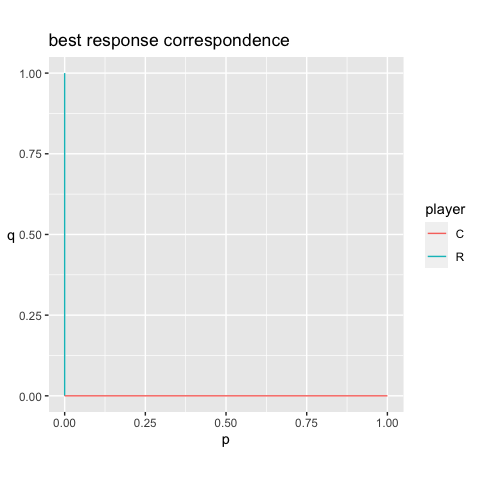
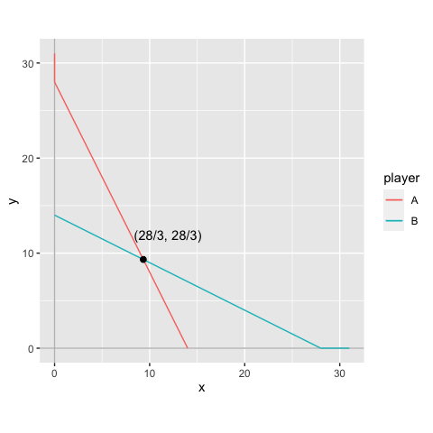

<!-- README.md is generated from README.Rmd. Please edit that file -->

rgamer
======

<!-- badges: start -->

[](https://www.tidyverse.org/lifecycle/#experimental)
[](https://travis-ci.org/yukiyanai/rgamer)
[](https://codecov.io/gh/yukiyanai/rgamer?branch=master)
<!-- badges: end -->

Overview
--------

The goal of `rgamer` is to help students learn Game Theory using R. The
functions provided by the package not only solve basic games such as
two-person normal-form games but also provides the users with visual
displays that highlight some aspects of the games — game matrices, best
response correspondence, etc. In addition, it suggests some numerical
solutions for games of which it is difficult — or even seems impossible
— to derive a closed-form analytic solution.

Installation
------------

<!--
#You can install the released version of rgamer from [CRAN](https://CRAN.R-project.org) with:

```r
install.packages("rgamer")
#> Warning: package 'rgamer' is not available (for R version 4.0.2)
```
-->

You can install the development version from
[GitHub](https://github.com/) with:

    # install.packages("devtools")
    devtools::install_github("yukiyanai/rgamer")

Example
-------

    library(rgamer)

### Example 1

An example of a normal-form game:

-   Player: {Kicker, GK }
-   Strategy: {(left, right), (left, right)}
-   Payoff: {(-1, 1, 1, -1), (1, -1, -1, 1)}

First, you define the game by `normal_form()`:

    game1 <- normal_form(
      players = c("Kicker", "GK"),
      s1 = c("left", "right"), 
      s2 = c("left", "right"),
      p1 = c(-1, 1, 1, -1), 
      p2 = c(1, -1, -1, 1))

Then, you can pass it to `solve_nfg()` function to get the table of the
game and the Nash equilibrium.

    s_game1 <- solve_nfg(game1, mixed = TRUE)

Pure strategy NE does not exist. Mixed-strategy NE: \[(1/2, 1/2), (1/2,
1/2)\]
<style>html {
  font-family: -apple-system, BlinkMacSystemFont, 'Segoe UI', Roboto, Oxygen, Ubuntu, Cantarell, 'Helvetica Neue', 'Fira Sans', 'Droid Sans', Arial, sans-serif;
}

#qgmxwmpcbu .gt_table {
  display: table;
  border-collapse: collapse;
  margin-left: auto;
  margin-right: auto;
  color: #333333;
  font-size: 16px;
  background-color: #FFFFFF;
  width: auto;
  border-top-style: solid;
  border-top-width: 2px;
  border-top-color: #A8A8A8;
  border-right-style: none;
  border-right-width: 2px;
  border-right-color: #D3D3D3;
  border-bottom-style: solid;
  border-bottom-width: 2px;
  border-bottom-color: #A8A8A8;
  border-left-style: none;
  border-left-width: 2px;
  border-left-color: #D3D3D3;
}

#qgmxwmpcbu .gt_heading {
  background-color: #FFFFFF;
  text-align: center;
  border-bottom-color: #FFFFFF;
  border-left-style: none;
  border-left-width: 1px;
  border-left-color: #D3D3D3;
  border-right-style: none;
  border-right-width: 1px;
  border-right-color: #D3D3D3;
}

#qgmxwmpcbu .gt_title {
  color: #333333;
  font-size: 125%;
  font-weight: initial;
  padding-top: 4px;
  padding-bottom: 4px;
  border-bottom-color: #FFFFFF;
  border-bottom-width: 0;
}

#qgmxwmpcbu .gt_subtitle {
  color: #333333;
  font-size: 85%;
  font-weight: initial;
  padding-top: 0;
  padding-bottom: 4px;
  border-top-color: #FFFFFF;
  border-top-width: 0;
}

#qgmxwmpcbu .gt_bottom_border {
  border-bottom-style: solid;
  border-bottom-width: 2px;
  border-bottom-color: #D3D3D3;
}

#qgmxwmpcbu .gt_col_headings {
  border-top-style: solid;
  border-top-width: 2px;
  border-top-color: #D3D3D3;
  border-bottom-style: solid;
  border-bottom-width: 2px;
  border-bottom-color: #D3D3D3;
  border-left-style: none;
  border-left-width: 1px;
  border-left-color: #D3D3D3;
  border-right-style: none;
  border-right-width: 1px;
  border-right-color: #D3D3D3;
}

#qgmxwmpcbu .gt_col_heading {
  color: #333333;
  background-color: #FFFFFF;
  font-size: 100%;
  font-weight: normal;
  text-transform: inherit;
  border-left-style: none;
  border-left-width: 1px;
  border-left-color: #D3D3D3;
  border-right-style: none;
  border-right-width: 1px;
  border-right-color: #D3D3D3;
  vertical-align: bottom;
  padding-top: 5px;
  padding-bottom: 6px;
  padding-left: 5px;
  padding-right: 5px;
  overflow-x: hidden;
}

#qgmxwmpcbu .gt_column_spanner_outer {
  color: #333333;
  background-color: #FFFFFF;
  font-size: 100%;
  font-weight: normal;
  text-transform: inherit;
  padding-top: 0;
  padding-bottom: 0;
  padding-left: 4px;
  padding-right: 4px;
}

#qgmxwmpcbu .gt_column_spanner_outer:first-child {
  padding-left: 0;
}

#qgmxwmpcbu .gt_column_spanner_outer:last-child {
  padding-right: 0;
}

#qgmxwmpcbu .gt_column_spanner {
  border-bottom-style: solid;
  border-bottom-width: 2px;
  border-bottom-color: #D3D3D3;
  vertical-align: bottom;
  padding-top: 5px;
  padding-bottom: 6px;
  overflow-x: hidden;
  display: inline-block;
  width: 100%;
}

#qgmxwmpcbu .gt_group_heading {
  padding: 8px;
  color: #333333;
  background-color: #FFFFFF;
  font-size: 100%;
  font-weight: initial;
  text-transform: inherit;
  border-top-style: solid;
  border-top-width: 2px;
  border-top-color: #D3D3D3;
  border-bottom-style: solid;
  border-bottom-width: 2px;
  border-bottom-color: #D3D3D3;
  border-left-style: none;
  border-left-width: 1px;
  border-left-color: #D3D3D3;
  border-right-style: none;
  border-right-width: 1px;
  border-right-color: #D3D3D3;
  vertical-align: middle;
}

#qgmxwmpcbu .gt_empty_group_heading {
  padding: 0.5px;
  color: #333333;
  background-color: #FFFFFF;
  font-size: 100%;
  font-weight: initial;
  border-top-style: solid;
  border-top-width: 2px;
  border-top-color: #D3D3D3;
  border-bottom-style: solid;
  border-bottom-width: 2px;
  border-bottom-color: #D3D3D3;
  vertical-align: middle;
}

#qgmxwmpcbu .gt_from_md > :first-child {
  margin-top: 0;
}

#qgmxwmpcbu .gt_from_md > :last-child {
  margin-bottom: 0;
}

#qgmxwmpcbu .gt_row {
  padding-top: 8px;
  padding-bottom: 8px;
  padding-left: 5px;
  padding-right: 5px;
  margin: 10px;
  border-top-style: solid;
  border-top-width: 1px;
  border-top-color: #D3D3D3;
  border-left-style: none;
  border-left-width: 1px;
  border-left-color: #D3D3D3;
  border-right-style: none;
  border-right-width: 1px;
  border-right-color: #D3D3D3;
  vertical-align: middle;
  overflow-x: hidden;
}

#qgmxwmpcbu .gt_stub {
  color: #333333;
  background-color: #FFFFFF;
  font-size: 100%;
  font-weight: initial;
  text-transform: inherit;
  border-right-style: solid;
  border-right-width: 2px;
  border-right-color: #D3D3D3;
  padding-left: 12px;
}

#qgmxwmpcbu .gt_summary_row {
  color: #333333;
  background-color: #FFFFFF;
  text-transform: inherit;
  padding-top: 8px;
  padding-bottom: 8px;
  padding-left: 5px;
  padding-right: 5px;
}

#qgmxwmpcbu .gt_first_summary_row {
  padding-top: 8px;
  padding-bottom: 8px;
  padding-left: 5px;
  padding-right: 5px;
  border-top-style: solid;
  border-top-width: 2px;
  border-top-color: #D3D3D3;
}

#qgmxwmpcbu .gt_grand_summary_row {
  color: #333333;
  background-color: #FFFFFF;
  text-transform: inherit;
  padding-top: 8px;
  padding-bottom: 8px;
  padding-left: 5px;
  padding-right: 5px;
}

#qgmxwmpcbu .gt_first_grand_summary_row {
  padding-top: 8px;
  padding-bottom: 8px;
  padding-left: 5px;
  padding-right: 5px;
  border-top-style: double;
  border-top-width: 6px;
  border-top-color: #D3D3D3;
}

#qgmxwmpcbu .gt_striped {
  background-color: rgba(128, 128, 128, 0.05);
}

#qgmxwmpcbu .gt_table_body {
  border-top-style: solid;
  border-top-width: 2px;
  border-top-color: #D3D3D3;
  border-bottom-style: solid;
  border-bottom-width: 2px;
  border-bottom-color: #D3D3D3;
}

#qgmxwmpcbu .gt_footnotes {
  color: #333333;
  background-color: #FFFFFF;
  border-bottom-style: none;
  border-bottom-width: 2px;
  border-bottom-color: #D3D3D3;
  border-left-style: none;
  border-left-width: 2px;
  border-left-color: #D3D3D3;
  border-right-style: none;
  border-right-width: 2px;
  border-right-color: #D3D3D3;
}

#qgmxwmpcbu .gt_footnote {
  margin: 0px;
  font-size: 90%;
  padding: 4px;
}

#qgmxwmpcbu .gt_sourcenotes {
  color: #333333;
  background-color: #FFFFFF;
  border-bottom-style: none;
  border-bottom-width: 2px;
  border-bottom-color: #D3D3D3;
  border-left-style: none;
  border-left-width: 2px;
  border-left-color: #D3D3D3;
  border-right-style: none;
  border-right-width: 2px;
  border-right-color: #D3D3D3;
}

#qgmxwmpcbu .gt_sourcenote {
  font-size: 90%;
  padding: 4px;
}

#qgmxwmpcbu .gt_left {
  text-align: left;
}

#qgmxwmpcbu .gt_center {
  text-align: center;
}

#qgmxwmpcbu .gt_right {
  text-align: right;
  font-variant-numeric: tabular-nums;
}

#qgmxwmpcbu .gt_font_normal {
  font-weight: normal;
}

#qgmxwmpcbu .gt_font_bold {
  font-weight: bold;
}

#qgmxwmpcbu .gt_font_italic {
  font-style: italic;
}

#qgmxwmpcbu .gt_super {
  font-size: 65%;
}

#qgmxwmpcbu .gt_footnote_marks {
  font-style: italic;
  font-size: 65%;
}
</style>
<div id="qgmxwmpcbu" style="overflow-x:auto;overflow-y:auto;width:auto;height:auto;">
<table class="gt_table" style="table-layout: fixed;; width: 0px">
<colgroup>
<col style="width:80px;"/>
<col style="width:80px;"/>
<col style="width:80px;"/>
</colgroup>
<thead class="gt_col_headings">
<tr>
<th class="gt_col_heading gt_center gt_columns_bottom_border" rowspan="2" colspan="1">
strategy
</th>
<th class="gt_center gt_columns_top_border gt_column_spanner_outer" rowspan="1" colspan="2">
<span class="gt_column_spanner">GK</span>
</th>
</tr>
<tr>
<th class="gt_col_heading gt_columns_bottom_border gt_center" rowspan="1" colspan="1">
left
</th>
<th class="gt_col_heading gt_columns_bottom_border gt_center" rowspan="1" colspan="1">
right
</th>
</tr>
</thead>
<tbody class="gt_table_body">
<tr class="gt_group_heading_row">
<td colspan="3" class="gt_group_heading">
Kicker
</td>
</tr>
<tr>
<td class="gt_row gt_center">
left
</td>
<td class="gt_row gt_center">
-1, 1&ast;
</td>
<td class="gt_row gt_center">
1&ast;, -1
</td>
</tr>
<tr>
<td class="gt_row gt_center">
right
</td>
<td class="gt_row gt_center">
1&ast;, -1
</td>
<td class="gt_row gt_center">
-1, 1&ast;
</td>
</tr>
</tbody>
</table>
</div>

In the table above, players’ best responses against each of the
opponent’s action is marked by an asterisk.

For a 2-by-2 game, you can plot the best response correspondences as
well.

    s_game1$br_plot

<!-- -->

### Example 2

An example of a normal-form game:

-   Player: { A, B }
-   Strategy: {*x* ∈ \[0, 30\], *y* ∈ \[0, 30\] }
-   Payoff:
    {*f*<sub>*x*</sub>(*x*, *y*) =  − *x*<sup>2</sup> + (28 − *y*)*x*,
    *f*<sub>*y*</sub>(*x*, *y*) =  − *y*<sup>2</sup> + (28 − *x*)*y*}

You can define a game by specifying payoff functions as character
vectors using `normal_form()`:

    game2 <- normal_form(
      players = c("A", "B"),
      p1 = "-x^2 + (28 - y) * x",
      p2 = "-y^2 + (28 - x) * y",
      par1_lim = c(0, 30),
      par2_lim = c(0, 30),
      pars = c("x", "y"))

Then, you can pass it to `solve_nfg()`, which displays the best response
correspondences by default.

    s_game2 <- solve_nfg(game2)

<!-- -->

    #> NE: (28/3, 28/3)

### Example 3

An example of a normal-form game:

-   Player: { A, B }
-   Strategy: {*x* ∈ \[0, 30\], *y* ∈ \[0, 30\] }
-   Payoff:
    {*f*<sub>*x*</sub>(*x*, *y*) =  − *x*<sup>*a*</sup> + (*b* − *y*)*x*,
    *f*<sub>*y*</sub>(*x*, *y*) =  − *y*<sup>*s*</sup> + (*t* − *x*)*y*}

You can define a normal-form game by specifying payoffs by R functions.

    f_x <- function(x, y, a, b) {
      -x^a + (b - y) * x
    }
    f_y <- function(x, y, s, t) {
      -y^s + (t - x) * y
    }
    game3 <- normal_form(
      players = c("A", "B"),
      p1 = f_x,
      p2 = f_y,
      par1_lim = c(0, 30),
      par2_lim = c(0, 30),
      pars = c("x", "y"))

Then, you can approximate a solution numerically by `solve_nfg()`. Note
that you need to set the parameter values of the function that should be
treated as constants by arguments `cons1` and `cons2`, each of which
accepts a named list. In addition, you can suppress the plot of best
responses by `plot = FALSE`.

    s_game3 <- solve_nfg(
      game = game3,
      cons1 = list(a = 2, b = 28),
      cons2 = list(s = 2, t = 28),
      plot = FALSE
    )
    #> approximated NE: (9.3, 9.3)

You can increase the precision of approximation by `precision` (default
is `1`), which takes a natural number.

    s_game3b <- solve_nfg(
      game = game3,
      cons1 = list(a = 2, b = 28),
      cons2 = list(s = 2, t = 28),
      precision = 3
    )

<!-- -->

    #> approximated NE: (9.333, 9.333)
