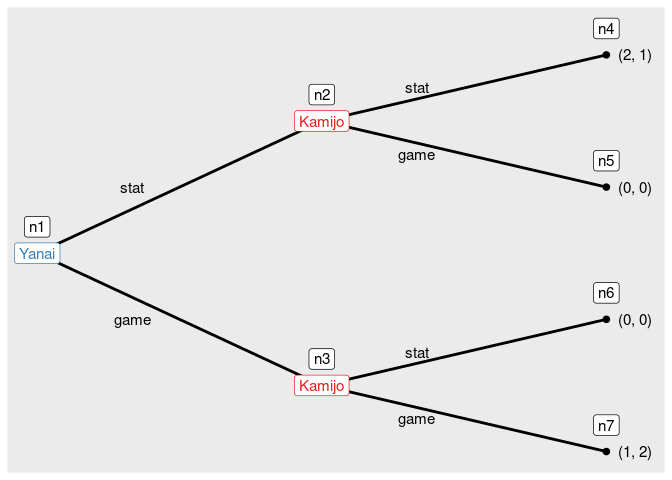
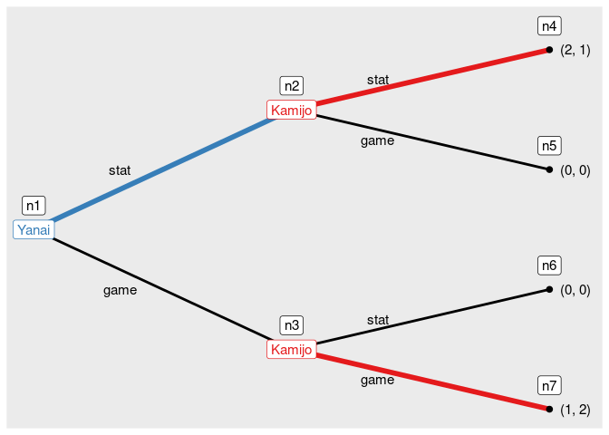

<!-- README.md is generated from README.Rmd. Please edit that file -->

# rgamer

<!-- badges: start -->

[](https://www.tidyverse.org/lifecycle/#experimental)
[](https://CRAN.R-project.org/package=rgamer)
[](https://travis-ci.org/yukiyanai/rgamer)
[](https://codecov.io/gh/yukiyanai/rgamer?branch=master)
[](https://github.com/yukiyanai/rgamer/actions)
<!-- badges: end -->

## Overview

The goal of `rgamer` is to help students learn Game Theory using R. The
functions prepared by the package not only solve basic games such as
two-person normal-form games but also provides the users with visual
displays that highlight some aspects of the games — payoff matrix, best
response correspondence, etc. In addition, it suggests some numerical
solutions for games of which it is difficult — or even seems impossible
— to derive a closed-form analytical solution.

## Installation

<!--
#You can install the released version of rgamer from [CRAN](https://CRAN.R-project.org) with:

```r
install.packages("rgamer")
#> Warning: package 'rgamer' is not available for this version of R
#> 
#> A version of this package for your version of R might be available elsewhere,
#> see the ideas at
#> https://cran.r-project.org/doc/manuals/r-patched/R-admin.html#Installing-packages
```
-->

You can install the development version from
[GitHub](https://github.com/) with:

``` r
# install.packages("remotes")
remotes::install_github("yukiyanai/rgamer")
```

or

``` r
# install.packages("devtools")
devtools::install_github("yukiyanai/rgamer")
```

## Examples

``` r
library(rgamer)
```

### Example 1

An example of a normal-form game (prisoner’s dilemma).

-   Player: {Kamijo, Yanai }
-   Strategy: {(Stays silent, Betrays), (Stays silent, Betrays)}
-   Payoff: {(-1, 0, -3, -2), (-1, -3, 0, -2)}

First, you define the game by `normal_form()`:

``` r
game1 <- normal_form(
  players = c("Kamijo", "Yanai"),
  s1 = c("Stays silent", "Betrays"), 
  s2 = c("Stays silent", "Betrays"), 
  payoffs1 = c(-1,  0, -3, -2), 
  payoffs2 = c(-1, -3,  0, -2))
```

You can specify payoffs for each cell of the game matrix as follows.

``` r
game1b <- normal_form(
  players = c("Kamijo", "Yanai"),
  s1 = c("Stays silent", "Betrays"), 
  s2 = c("Stays silent", "Betrays"), 
  cells = list(c(-1, -1), c(-3,  0),
               c( 0, -3), c(-2, -2)),
  byrow = TRUE)
```

Then, you can pass it to `solve_nfg()` function to get the table of the
game and the Nash equilibrium.

``` r
s_game1 <- solve_nfg(game1, show_table = FALSE)
#> Pure-strategy NE: [Betrays, Betrays]
```

``` r
s_game1$table
```

<table class=" lightable-classic table" style="font-family: Arial; margin-left: auto; margin-right: auto; width: auto !important; margin-left: auto; margin-right: auto;">
<thead>
<tr>
<th style="empty-cells: hide;" colspan="2">
</th>
<th style="padding-bottom:0; padding-left:3px;padding-right:3px;text-align: center; font-weight: bold; " colspan="2">

<div style="border-bottom: 1px solid #111111; margin-bottom: -1px; ">

Yanai

</div>

</th>
</tr>
<tr>
<th style="text-align:left;">
</th>
<th style="text-align:center;">
strategy
</th>
<th style="text-align:center;">
Stays silent
</th>
<th style="text-align:center;">
Betrays
</th>
</tr>
</thead>
<tbody>
<tr>
<td style="text-align:left;font-weight: bold;">
Kamijo
</td>
<td style="text-align:center;">
Stays silent
</td>
<td style="text-align:center;">
-1, -1
</td>
<td style="text-align:center;">
-3, 0^
</td>
</tr>
<tr>
<td style="text-align:left;font-weight: bold;">
</td>
<td style="text-align:center;">
Betrays
</td>
<td style="text-align:center;">
0^, -3
</td>
<td style="text-align:center;">
-2^, -2^
</td>
</tr>
</tbody>
</table>

### Example 2

An example of a coordination game.

-   Player: {Kamijo, Yanai }
-   Strategy: {(Stag, Hare), (Stag, Hare)}
-   Payoff: {(10, 8, 0, 7), (10, 0, 8, 7)}

Define the game by `normal_form()`:

``` r
game2 <- normal_form(
  players = c("Kamijo", "Yanai"),
  s1 = c("Stag", "Hare"), 
  s2 = c("Stag", "Hare"), 
  payoffs1 = c(10, 8, 0, 7), 
  payoffs2 = c(10, 0, 8, 7))
```

Then, you can pass it to `solve_nfg()` function to get NEs. Set
`mixed = TRUE` to find mixed-strategy NEs well.

``` r
s_game2 <- solve_nfg(game2, mixed = TRUE, show_table = FALSE)
#> Pure-strategy NE: [Stag, Stag], [Hare, Hare]
#> Mixed-strategy NE: [(7/9, 2/9), (7/9, 2/9)]
#> The obtained mixed-strategy NE might be only a part of the solutions.
#> Please examine br_plot (best response plot) carefully.
```

For a 2-by-2 game, you can plot the best response correspondences as
well.

``` r
s_game2$br_plot
```

<!-- -->

### Example 3

An example of a normal-form game:

-   Player: { A, B }
-   Strategy:
    {![x \\in \[0, 30\]](https://latex.codecogs.com/png.image?%5Cdpi%7B110%7D&space;%5Cbg_white&space;x%20%5Cin%20%5B0%2C%2030%5D "x \in [0, 30]"),
    ![y \\in \[0, 30\]](https://latex.codecogs.com/png.image?%5Cdpi%7B110%7D&space;%5Cbg_white&space;y%20%5Cin%20%5B0%2C%2030%5D "y \in [0, 30]")
    }
-   Payoff:
    { = -x^2 + (28 - y)x"),
     = -y^2 + (28 - x) y")}

You can define a game by specifying payoff functions as character
vectors using `normal_form()`:

``` r
game3 <- normal_form(
  players = c("A", "B"),
  payoffs1 = "-x^2 + (28 - y) * x",
  payoffs2 = "-y^2 + (28 - x) * y",
  par1_lim = c(0, 30),
  par2_lim = c(0, 30),
  pars = c("x", "y"))
```

Then, you can pass it to `solve_nfg()`, which displays the best response
correspondences by default.

``` r
s_game3 <- solve_nfg(game3)
#> approximated NE: (9.3, 9.3)
#> The obtained NE might be only a part of the solutions.
#> Please examine br_plot (best response plot) carefully.
```

<!-- -->

### Example 4

An example of a normal-form game:

-   Player: { A, B }
-   Strategy:
    {![x \\in \[0, 30\]](https://latex.codecogs.com/png.image?%5Cdpi%7B110%7D&space;%5Cbg_white&space;x%20%5Cin%20%5B0%2C%2030%5D "x \in [0, 30]"),
    ![y \\in \[0, 30\]](https://latex.codecogs.com/png.image?%5Cdpi%7B110%7D&space;%5Cbg_white&space;y%20%5Cin%20%5B0%2C%2030%5D "y \in [0, 30]")
    }
-   Payoff:
    { = -x^a + (b - y)x"),
     = -y^s + (t - x) y")}

You can define a normal-form game by specifying payoffs by R functions.

``` r
f_x <- function(x, y, a, b) {
  -x^a + (b - y) * x
}
f_y <- function(x, y, s, t) {
  -y^s + (t - x) * y
}
game4 <- normal_form(
  players = c("A", "B"),
  payoffs1 = f_x,
  payoffs2 = f_y,
  par1_lim = c(0, 30),
  par2_lim = c(0, 30),
  pars = c("x", "y"))
```

Then, you can approximate a solution numerically by `solve_nfg()`. Note
that you need to set the parameter values of the function that should be
treated as constants by arguments `cons1` and `cons2`, each of which
accepts a named list. In addition, you can suppress the plot of best
responses by `plot = FALSE`.

``` r
s_game4 <- solve_nfg(
  game = game4,
  cons1 = list(a = 2, b = 28),
  cons2 = list(s = 2, t = 28),
  plot = FALSE)
#> approximated NE: (9.3, 9.3)
#> The obtained NE might be only a part of the solutions.
#> Please examine br_plot (best response plot) carefully.
```

You can increase the precision of approximation by `precision`, which
takes a natural number (default is `precision = 1`).

``` r
s_game4b <- solve_nfg(
  game = game4,
  cons1 = list(a = 2, b = 28),
  cons2 = list(s = 2, t = 28),
  precision = 3)
#> approximated NE: (9.333, 9.333)
#> The obtained NE might be only a part of the solutions.
#> Please examine br_plot (best response plot) carefully.
```

<!-- -->

You can extract the best response plot with NE marked as follows.

``` r
s_game4b$br_plot_NE
```

<!-- -->

## Example 5

You can define payoffs by R functions and evaluate them at some
discretized values by setting `discretize = TRUE`. The following is a
Bertrand competition example:

``` r
func_price1 <- function(p, q) {
  if (p < q) {
    profit <- p
  } else if (p == q) {
    profit <- 0.5 * p
  } else {
    profit <- 0
  }
  profit
}

func_price2 <- function(p, q){
  if (p > q) {
    profit <- q
  } else if (p == q) {
    profit <- 0.5 * q
  } else {
    profit <- 0
  }
  profit
}

game5 <- normal_form(
  payoffs1 = func_price1,
  payoffs2 = func_price2,
  pars = c("p", "q"),
  par1_lim = c(0, 10),
  par2_lim = c(0, 10),
  discretize = TRUE)
```

Then, you can examine the specified part of the game.

``` r
s_game5 <- solve_nfg(game5, mark_br = FALSE)
```

<table class=" lightable-classic table" style="font-family: Arial; margin-left: auto; margin-right: auto; width: auto !important; margin-left: auto; margin-right: auto;">
<thead>
<tr>
<th style="empty-cells: hide;" colspan="2">
</th>
<th style="padding-bottom:0; padding-left:3px;padding-right:3px;text-align: center; font-weight: bold; " colspan="6">

<div style="border-bottom: 1px solid #111111; margin-bottom: -1px; ">

Player 2

</div>

</th>
</tr>
<tr>
<th style="text-align:left;">
</th>
<th style="text-align:center;">
strategy
</th>
<th style="text-align:center;">
0
</th>
<th style="text-align:center;">
2
</th>
<th style="text-align:center;">
4
</th>
<th style="text-align:center;">
6
</th>
<th style="text-align:center;">
8
</th>
<th style="text-align:center;">
10
</th>
</tr>
</thead>
<tbody>
<tr>
<td style="text-align:left;font-weight: bold;">
Player 1
</td>
<td style="text-align:center;">
0
</td>
<td style="text-align:center;">
0, 0
</td>
<td style="text-align:center;">
0, 0
</td>
<td style="text-align:center;">
0, 0
</td>
<td style="text-align:center;">
0, 0
</td>
<td style="text-align:center;">
0, 0
</td>
<td style="text-align:center;">
0, 0
</td>
</tr>
<tr>
<td style="text-align:left;font-weight: bold;">
</td>
<td style="text-align:center;">
2
</td>
<td style="text-align:center;">
0, 0
</td>
<td style="text-align:center;">
1, 1
</td>
<td style="text-align:center;">
2, 0
</td>
<td style="text-align:center;">
2, 0
</td>
<td style="text-align:center;">
2, 0
</td>
<td style="text-align:center;">
2, 0
</td>
</tr>
<tr>
<td style="text-align:left;font-weight: bold;">
</td>
<td style="text-align:center;">
4
</td>
<td style="text-align:center;">
0, 0
</td>
<td style="text-align:center;">
0, 2
</td>
<td style="text-align:center;">
2, 2
</td>
<td style="text-align:center;">
4, 0
</td>
<td style="text-align:center;">
4, 0
</td>
<td style="text-align:center;">
4, 0
</td>
</tr>
<tr>
<td style="text-align:left;font-weight: bold;">
</td>
<td style="text-align:center;">
6
</td>
<td style="text-align:center;">
0, 0
</td>
<td style="text-align:center;">
0, 2
</td>
<td style="text-align:center;">
0, 4
</td>
<td style="text-align:center;">
3, 3
</td>
<td style="text-align:center;">
6, 0
</td>
<td style="text-align:center;">
6, 0
</td>
</tr>
<tr>
<td style="text-align:left;font-weight: bold;">
</td>
<td style="text-align:center;">
8
</td>
<td style="text-align:center;">
0, 0
</td>
<td style="text-align:center;">
0, 2
</td>
<td style="text-align:center;">
0, 4
</td>
<td style="text-align:center;">
0, 6
</td>
<td style="text-align:center;">
4, 4
</td>
<td style="text-align:center;">
8, 0
</td>
</tr>
<tr>
<td style="text-align:left;font-weight: bold;">
</td>
<td style="text-align:center;">
10
</td>
<td style="text-align:center;">
0, 0
</td>
<td style="text-align:center;">
0, 2
</td>
<td style="text-align:center;">
0, 4
</td>
<td style="text-align:center;">
0, 6
</td>
<td style="text-align:center;">
0, 8
</td>
<td style="text-align:center;">
5, 5
</td>
</tr>
</tbody>
</table>

## Example 6

You can draw a tree of an extensive form game.

``` r
game6 <- extensive_form(
  players = list("Yanai", 
                 rep("Kamijo", 2),
                 rep(NA, 4)),
  actions = list(c("stat", "game"),
                  c("stat", "game"), c("stat", "game")),
  payoffs = list(Yanai = c(2, 0, 0, 1),
                 Kamijo = c(1, 0, 0, 2)),
  direction = "right")
```

<!-- -->

And you can find the solution of the game by `solve_efg()`.

``` r
s_game6 <- solve_efg(game6)
#> backward induction: [(stat), (stat, game)]
```

Then, you can see the path played under a solution by `show_path()`.

``` r
show_path(s_game6)
```

<!-- -->
