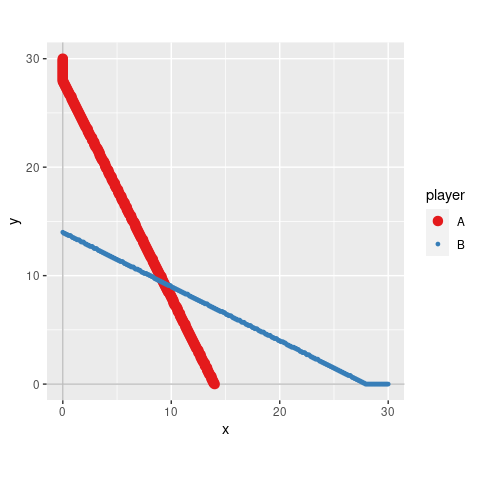

<!-- README.md is generated from README.Rmd. Please edit that file -->

rgamer
======

<!-- badges: start -->

[](https://www.tidyverse.org/lifecycle/#experimental)
[](https://travis-ci.org/yukiyanai/rgamer)
[](https://codecov.io/gh/yukiyanai/rgamer?branch=master)
<!-- badges: end -->

Overview
--------

The goal of `rgamer` is to help students learn Game Theory using R. The
functions provided by the package not only solve basic games such as
two-person normal-form games but also provides the users with visual
displays that highlight some aspects of the games — game tables, best
response correspondences, etc. In addition, it suggests some numerical
solutions for games of which it is difficult — or even seems impossible
— to derive a closed-form analytical solution.

Installation
------------

<!--
#You can install the released version of rgamer from [CRAN](https://CRAN.R-project.org) with:

```r
install.packages("rgamer")
#> Warning: package 'rgamer' is not available (for R version 3.6.3)
```
-->

You can install the development version from
[GitHub](https://github.com/) with:

    # install.packages("devtools")
    devtools::install_github("yukiyanai/rgamer")

Examples
--------

    library(rgamer)

### Example 1

An example of a normal-form game (prisoner’s dilemma).

-   Player: {Kamijo, Yanai }
-   Strategy: {(Stays silent, Betrays), (Stays silent, Betrays)}
-   Payoff: {(-1, 0, -3, -2), (-1, -3, 0, -2)}

First, you define the game by `normal_form()`:

    game1 <- normal_form(
      players = c("Kamijo", "Yanai"),
      s1 = c("Stays silent", "Betrays"), 
      s2 = c("Stays silent", "Betrays"), 
      p1 = c(-1,  0, -3, -2), 
      p2 = c(-1, -3,  0, -2))

Then, you can pass it to `solve_nfg()` function to get the table of the
game and the Nash equilibrium.

    s_game1 <- solve_nfg(game1)

    #> Pure-strategy NE: (Betrays, Betrays)


### Example 2

An example of a coordination game.

-   Player: {Kamijo, Yanai }
-   Strategy: {(Stag, Hare), (Stag, Hare)}
-   Payoff: {(10, 8, 0, 7), (10, 0, 8, 7)}

Define the game by `normal_form()`:

    game2 <- normal_form(
      players = c("Kamijo", "Yanai"),
      s1 = c("Stag", "Hare"), 
      s2 = c("Stag", "Hare"), 
      p1 = c(10, 8, 0, 7), 
      p2 = c(10, 0, 8, 7))

Then, you can pass it to `solve_nfg()` function to get NEs. Set
`mixed = TRUE` to find mixed-strategy NEs well.

    s_game2 <- solve_nfg(game2, mixed = TRUE, show_table = FALSE)
    #> Pure-strategy NE: (Stag, Stag)(Hare, Hare)
    #> Mixed-strategy NE: [(7/9, 2/9), (7/9, 2/9)]
    #> #  The obtained mixed-strategy NE might be only a part of the solutions.
    #> #  Please examine br_plot (best response plot) carefully.

For a 2-by-2 game, you can plot the best response correspondences as
well.

    s_game2$br_plot

<!-- -->

### Example 3

An example of a normal-form game:

-   Player: { A, B }
-   Strategy: {*x* ∈ \[0, 30\], *y* ∈ \[0, 30\] }
-   Payoff:
    {*f*<sub>*x*</sub>(*x*, *y*) =  − *x*<sup>2</sup> + (28 − *y*)*x*,
    *f*<sub>*y*</sub>(*x*, *y*) =  − *y*<sup>2</sup> + (28 − *x*)*y*}

You can define a game by specifying payoff functions as character
vectors using `normal_form()`:

    game3 <- normal_form(
      players = c("A", "B"),
      p1 = "-x^2 + (28 - y) * x",
      p2 = "-y^2 + (28 - x) * y",
      par1_lim = c(0, 30),
      par2_lim = c(0, 30),
      pars = c("x", "y"))

Then, you can pass it to `solve_nfg()`, which displays the best response
correspondences by default.

    s_game3 <- solve_nfg(game3)
    #> NE: (28/3, 28/3)
    #> #  The obtained NE might be only a part of the solutions.
    #> #  Please examine br_plot (best response plot) carefully.

<!-- -->

### Example 4

An example of a normal-form game:

-   Player: { A, B }
-   Strategy: {*x* ∈ \[0, 30\], *y* ∈ \[0, 30\] }
-   Payoff:
    {*f*<sub>*x*</sub>(*x*, *y*) =  − *x*<sup>*a*</sup> + (*b* − *y*)*x*,
    *f*<sub>*y*</sub>(*x*, *y*) =  − *y*<sup>*s*</sup> + (*t* − *x*)*y*}

You can define a normal-form game by specifying payoffs by R functions.

    f_x <- function(x, y, a, b) {
      -x^a + (b - y) * x
    }
    f_y <- function(x, y, s, t) {
      -y^s + (t - x) * y
    }
    game4 <- normal_form(
      players = c("A", "B"),
      p1 = f_x,
      p2 = f_y,
      par1_lim = c(0, 30),
      par2_lim = c(0, 30),
      pars = c("x", "y"))

Then, you can approximate a solution numerically by `solve_nfg()`. Note
that you need to set the parameter values of the function that should be
treated as constants by arguments `cons1` and `cons2`, each of which
accepts a named list. In addition, you can suppress the plot of best
responses by `plot = FALSE`.

    s_game4 <- solve_nfg(
      game = game4,
      cons1 = list(a = 2, b = 28),
      cons2 = list(s = 2, t = 28),
      plot = FALSE
    )
    #> approximated NE: (9.3, 9.3)
    #> #  The obtained NE might be only a part of the solutions.
    #> #  Please examine br_plot (best response plot) carefully.

You can increase the precision of approximation by `precision`, which
takes a natural number (default is `precision = 1`).

    s_game5 <- solve_nfg(
      game = game4,
      cons1 = list(a = 2, b = 28),
      cons2 = list(s = 2, t = 28),
      precision = 3
    )
    #> approximated NE: (9.333, 9.333)
    #> #  The obtained NE might be only a part of the solutions.
    #> #  Please examine br_plot (best response plot) carefully.

<!-- -->

Example 5
---------

You can draw a tree of an extensive form game.

    game6 <- extensive_form(
      players = list("f", c("m", "m")),
      n_node = c(1, 2, 4),
      n_choice = list(2,
                      c(2, 2),
                      rep(0, 4)),
      strategy = list(c("ballet", "baseball"),
                      c("ballet", "baseball"), c("ballet", "baseball")),
      payoff = list(f = c(2, 0, 0, 1),
                    m = c(1, 0, 0, 2)),
      quietly = TRUE
    )

<!-- -->

And you can show the equilibrium path by setting `mark_path = TRUE`.

    game6 <- extensive_form(
      players = list("f", c("m", "m")),
      n_node = c(1, 2, 4),
      n_choice = list(2,
                      c(2, 2),
                      rep(0, 4)),
      strategy = list(c("ballet", "baseball"),
                      c("ballet", "baseball"), c("ballet", "baseball")),
      payoff = list(f = c(2, 0, 0, 1),
                    m = c(1, 0, 0, 2)),
      mark_path = TRUE
    )

<!-- --> \`\`\`
